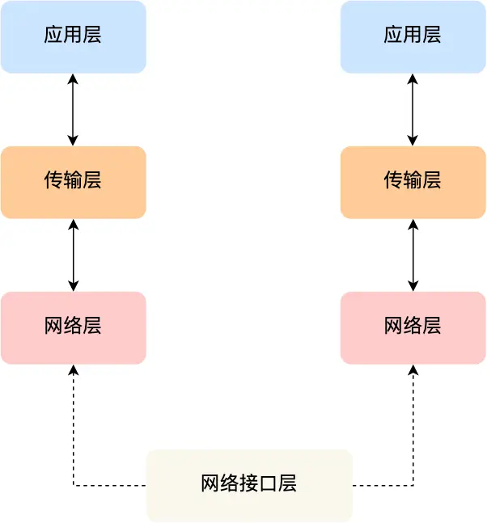
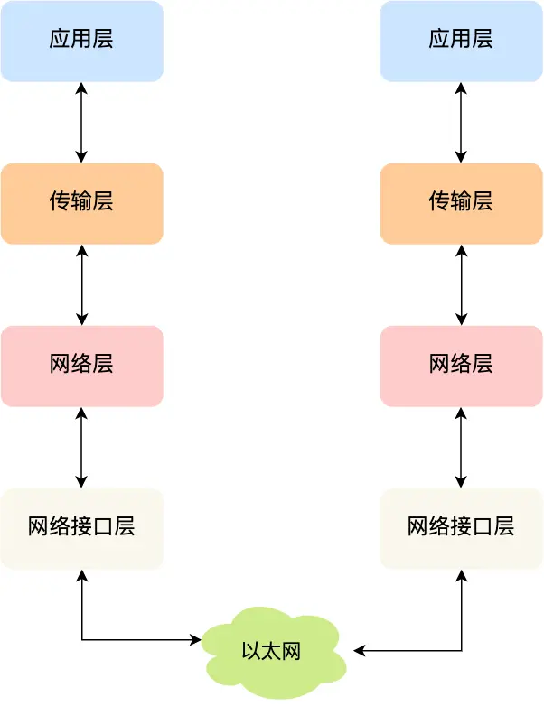

# TCP/IP 网络模型有哪几层

 问大家，为什么要有TCP/IP网络模型?
- 对于同一台设备上的进程通信，有很多方式，比如管道、消息队列、共享内存、信号等方式
- 而不同设备商的进程通信，需要网络通信，而设备是多样性，所以要兼容多种多样的设备，就协商**一套通用的网络协议**

这个网络协议是分层的，每一层都有各自的作用和职责

## 应用层

最上层，也是我们能直接接触到就是**应用层(Application Layer)**，我们电脑或手机的应用软件都是在应用层实现。
两个不同设备的应用需要通信的时候，应用把应用数据传给下一层，也就是传输层。

应用层只需要专注为用户提供应用功能，比如HTTP、FTP、Telnet、DNS、SMTP等。

应用层不用关心数据是如何传输

## 传输层

应用层的数据包会传给传输层，**传输层(Transport Layer)** 是为应用层提供网络支持

在传输层会有两个传输协议，分别是TCP和UDP

TCP的全称叫传输控制协议(Transmission Control Protocol),HTTP基于此。TCP相比UDP多了很多特性，比如流量控制、超时重传、拥塞控制等都是为了保证数据包可靠地传输给对方。

UDP相对来说很简单，只负责发送数据包，不保证数据包是否能到达对方，但它实时性相对要好，传输效率也高。

当数据量过多的时候，传输层的数据包超过MSS(TCP最大报文段长度)，就要将数据包分块，这样即使中途有一个分块丢失或损坏，只要重新发送这一个分块，而不用重新发送整个数据包。在TCP协议中，我们把每个分块称为**TCP段(TCP Segment)**

当设备作为接收方，传输层则要负责把数据包传给应用，但是一台设备上可能有很多应用在接收或者传输数据，因此需要一个编号将应用区分开来，这个编号就是**端口**

## 网络层

传输层，只需要服务好应用即可，让其作为应用层数据传输媒介，帮助实现应用到应用的通信，而实际的传输功能交给下一层，也就是**网络层(Internet Layer)**

网络层最常使用的是IP协议(Internet Protocol),IP协议将会传输层的报文作为数据部分，再加上IP包头组装成IP报文，如果IP报文大小超过MTU(以太网一般1500字节)就会**再次进行分片**,得到一个即将发送到网络的IP报文。

暂时这么理解：进程是端口，设备是IP地址。网络层负责将数据从一个设备传输到另外一个设备，利用IP地址给设备进行编号。

对于IPv4协议，IP地址共32位，分成四段(比如:192.168.100.1),每段是8位。只有一个单纯的IP地址虽然做到了区分，但是全世界设备太多了，不能一个个去匹配。

IP地址分成两种意义:
- 一个是网络号，负责标识该IP地址是属于哪个[子网]的
- 一个是主机号,负责标识同一[子网]下的不同主机

这需要配合**子网掩码**才能算出IP地址的网络号和主机号

举个例子，比如 10.100.122.0/24，后面的/24表示就是 255.255.255.0 子网掩码，255.255.255.0 二进制是「11111111-11111111-11111111-00000000」，大家数数一共多少个1？不用数了，是 24 个1，为了简化子网掩码的表示，用/24代替255.255.255.0。

- 将 10.100.122.2 和 255.255.255.0 进行**按位与运算**，就可以得到网络号
- 将255.255.255.0 取反后与IP地址进行进行**按位与运算**，就可以得到主机号

IP协议能力
- 寻址
- 路由
  

**路由是类似导航地图推荐三种方案，寻址是确定了要走哪条道路，跟着地图走**

## 网络接口层

生成IP头部之后，接下来**网络接口层(Link Layer)**在IP头部的前面加上MAC头部，并封装成数据帧(Data frame)发送到网络上

关凭IP报文中，接收方IP的地址，我就可以判断要将包发到哪里，但是在以太网的世界中，这个思路是行不通。

什么是以太网呢?电脑上的以太网接口，Wi-Fi接口，以太网交换机、路由器上的千兆，万兆以太网口，还有网线，它们都是以太网的组成部分。以太网就是一种在「局域网」内，把附近的设备连接起来，使它们之间可以进行通讯的技术。

以太网在判断网络包目的地时和IP的方式不同，必须采用相匹配的方式才能在以太网中将包发往目的地。而 MAC 头部就是干这个用的，所以，在以太网进行通讯要用到 MAC 地址。

MAC 头部是以太网使用的头部，它包含了接收方和发送方的 MAC 地址等信息，我们可以通过 ARP 协议获取对方的 MAC 地址。工作在网卡这个层次，使用 MAC 地址来标识网络上的设备。

# 总结
TCP/IP网络通常是由上到下分成4层，分别是**应用层，传输层，网络层和网络接口层**

每一层的封装格式

网络接口层的传输单位是帧（frame），IP 层的传输单位是包（packet），TCP 层的传输单位是段（segment），HTTP 的传输单位则是消息或报文（message）。但这些名词并没有什么本质的区分，可以统称为数据包。