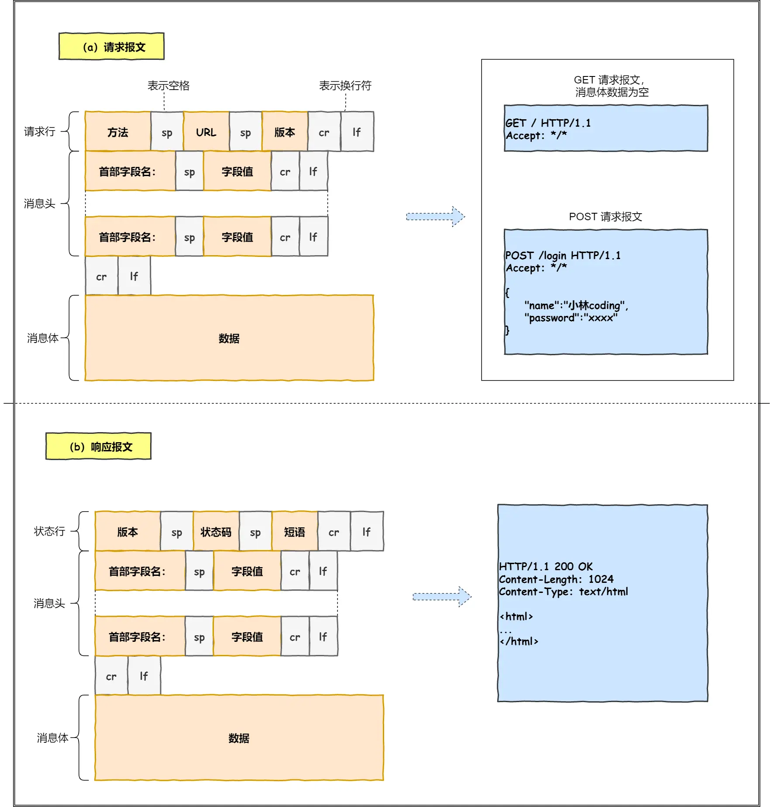

# 键入网址到网页显示，期间发生了什么？

## 孤单小弟——HTTP

1. > 浏览器做的第一步工作就是解析URL

2. > 生成HTTP请求信息

对URL进行解析之后，浏览器确定了Web服务器和文件名，接下来根据这些信息生成HTTP请求

## 真实地址查询——DNS：web服务器域名与IP的对应关系

通过浏览器解析URL并生成HTTP消息后，需要将消息发送给web服务器

在发送之前，还有一项工作，就是**查询服务器域名对应的IP地址**，因为委托操作系统发送消息时，必须提供通信对象的 IP 地址。

域名-IP地址就像通讯录里姓名-电话号。所以，有一种服务器就专门保存了 Web 服务器域名与 IP 的对应关系，它就是 DNS 服务器。

### 域名的层级结构

在域名中，越靠右的位置表示其层级越高。

实际上域名最后还有一个点，比如 www.server.com.，这个最后的一个点代表根域名。

也就是，. 根域是在最顶层，它的下一层就是 .com 顶级域，再下面是 server.com。

所以域名的层级关系类似一个树状结构：

- 根DNS服务器(.)
- 顶级域DNS服务器(.com)
- 权威DNS服务器(server.com)**我的域名我做主**

### 域名解析流程

- 客户端先发送一个DNS请求，问wwww.server.com的IP是啥，并发给本地DNS服务器
- 本地DNS先寻找看看有没有缓存有返回，没有就找根DNS服务器(.)
- 根服务器(.)发现是(.com)服务器，让本地服务器去问(.com)
- 本地服务器找到(.com),(.com)发现是(server.com),指路本地去找它
- (server.com)就是权威服务器，查到IP地址就告诉本地服务器
- 本地返回之后，将IP地址返回客户端，客户端与目标建立连接
  

当然真实情况不需要这么复杂，有缓存机制，看看浏览器，看看操作系统，看看hosts，看看本地

## 指南好帮手——协议栈:告诉你一层一层找下去

通过DNS获取到IP后，就可以把HTTP的传输工作交给操作系统的**协议栈**

## 可靠传输——TCP

HTTP是基于TCP协议传输的

先看看TCP报文头部的格式

首先，**源端口号**和**目标端口号**是不可少的，如果没有这两个端口号，数据不知道应该发给哪个应用

接下来还有包的**序号**，这个是为了解决包乱序的问题

还有应该有**确认号**，目的是确认发出对方是否有收到，如果没有收到应该重新发送，直到送达，这个是为了解决丢包的问题

接下来还有一些**状态位**，例如SYN是发起一个连接，ACK是回复，RST是重新连接，FIN是结束连接等。TCP 是面向连接的，因而双方要维护连接的状态，这些带状态位的包的发送，会引起双方的状态变更。

还有一个重要的就是**窗口大小**。TCP 要做流量控制，通信双方各声明一个窗口（缓存大小），标识自己当前能够的处理能力，别发送的太快，撑死我，也别发的太慢，饿死我。

除了做流量控制以外，TCP还会做**拥塞控制**，对于真正的通路堵车不堵车，它无能为力，唯一能做的就是控制自己，也即控制发送的速度。不能改变世界，就改变自己嘛。

### 三次握手

- 一开始，客户端和服务端都属于**CLOSED**状态。先是服务端主动监听某个端口，处于**LISTEN**状态
- 然后客户端主动发起连接**SYN**,之后处于**SYN-SENT**状态。
- 服务端收到发起的连接，返回SYN,并且ACk客户端的SYN，之后处于SYN-RCVD状态
- 客户端收到服务端发送的SYN和ACk之后，发SYN，自身处于**ESTABLISHED**状态，因为它一发一收成功了
- 服务端收到ACK之后，处于ESTABLISHED，因为它也一发一收。

>  三次握手目的就是保证双方都有发送和接收的能力

## 远程定位——IP

## 两点传输——MAC
生成IP头部之后，接下来网络包还需要在IP头部前面加上MAC头部

## 出口——网卡

网卡会包装电信号，通过网线发送出去

## 送别者——交换机 
交换机是将网络包原样转发到目的地

##  出境大门——路由器：转发再转发

## 相互扒皮——服务器与客户端
数据包抵达了服务器，服务器肯定高兴呀，正所谓有朋自远方来，不亦乐乎？

服务器高兴的不得了，于是开始扒数据包的皮！就好像你收到快递，能不兴奋吗？

最后，客户端要离开了，向服务器发起了 TCP 四次挥手，至此双方的连接就断开了。