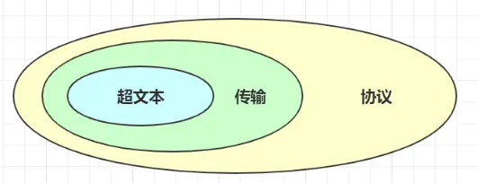
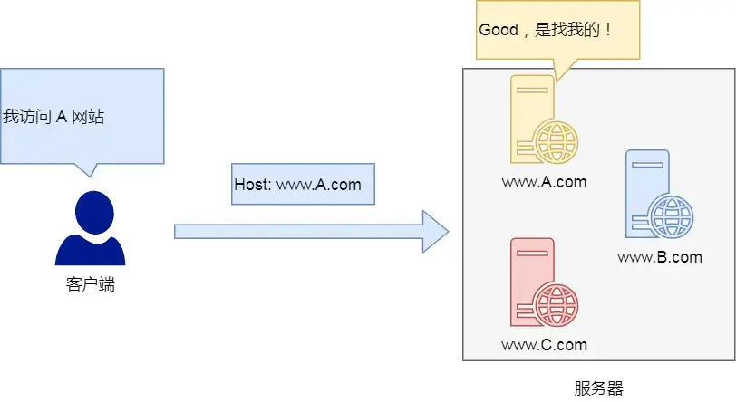
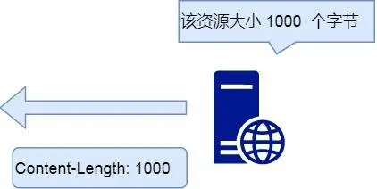
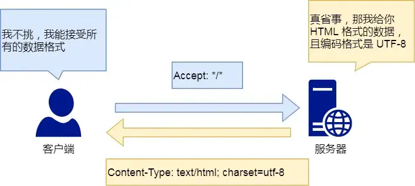

# HTTP基本概念

## HTTP是什么?
HTTP是超文本传输协议,也就是HyperText Transfer Protocol
 

- 超文本:它就是超越了普通文本的文本，它是文字、图片、视频等的混合体，最关键有超链接，能从一个超文本跳转到另外一个超文本。


- 传输:两点之间传输A->B,B->A

- 协议:一种约定俗成

**HTTP 是一个在计算机世界里专门在「两点」之间「传输」文字、图片、音频、视频等「超文本」数据的「约定和规范」。**


## HTTP 常见的状态码有哪些？

- 1xx类状态码属性**提示信息**，是协议处理中的一种中间状态，实际用得比较少
- 2xx类状态码表示服务器**成功**处理了客户端的请求
  - [200 ok]最常见的成功状态码
  - [204 No Content]常见的成功状态码,但是响应头没有body数据
  - [206 Partial Content]是应用于HTTP分块下载或断点续传，返回一部分数据
  
- 3xx类状态码表示客户端请求的资源发生改变，需要客户端用新的URL重新发送请求获取资源，也就是**重定向**
  
    - [301 Moved Permanently]表示永久重定向,请求资源已经不存在，需改用新的URL再次访问
    - [302 Found]表示临时重定向，说明请求资源还在，暂时需要另一个URL来访问
    - [304 Not Modified]使用缓存
- 4xx类状态码表示客户端发送**报文有误**，服务器无法处理，也是错误码的含义
    - [400 Bad Request] 表示客户端请求的报文有错误，只是个笼统错误
    - [403 Forbidden]表示服务器禁止访问资源，并不是客户端请求出错
    - [404 Not Found]表示请求资源在服务器不存在，无法提供给客户端
  

- 5xx类状态码客户端请求报文正确,**服务器处理时内部发生了错误**，属于服务端的错误码
  - [500 Internal Server Error]与400类型一样
  - [501 Not Implemented]表示客户端请求的功能还不支持
  - [502 Bad Gateway]通常是服务器作为网关或代理时返回的错误码，表示服务器自身工作正常，访问后端服务器发生了错误。
  - [503 Service Unavailable]表示服务器当前很忙，暂时无法响应客户端，类似“网络服务正忙，请稍后重试”的意思。


## HTTP常见字段有哪些？

### Host字段:客户端发送请求时，用来指定服务器的域名



```js
Host:www.A.com
```
有了Host字段，就可以将请求发往[同一台]服务器上的不同网络

###  Content-Length字段:表明本次回应的数据长度



```js
Content-Length:1000
```


### Connection字段:常用于保持长连接


开启了 HTTP Keep-Alive 机制后， 连接就不会中断，而是保持连接。当客户端发送另一个请求时，它会使用同一个连接，一直持续到客户端或服务器端提出断开连接。

```js
Connection:Keep-Alive
```


### Content-Type字段：字段用于服务器回应时，告诉客户端，本次数据是什么格式。


text/html是客户端返回的字段

```js
Content-Type:text/html;Charset=utf-8
```
发送的是网页，而且编码是UTF-8。


### Content-Encoding:数据压缩格式