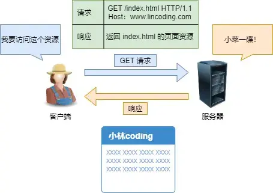

# GET与POST

## GET和POST有什么区别？

- GET:
  GET的语义是从服务器获取指定的资源，这个资源可以是静态的文本、页面、图片视频等。

  GET请求的参数位置一般是写在URL中，URL规定只能支持ASCII，所有GET请求的参数只能ASCII

  而且浏览器会对URL的长度有限制

- POST:
    POST的语义是请求负荷(报文body)对指定资源做出处理，具体的处理视请求资源类型不同

    POST请求携带数据的位置一般是写在body中，body中数据可以是任意格式

    只要客户端与服务端协商好，而且浏览器不会对body大小做限制

## GET和POST方法是否安全和幂等?

解释下安全和幂等
- 在HTTP协议，所谓安全是指请求方法不会[破坏]服务器上的资源
- 所谓[幂等]，意思是多次执行相同的操作，结果都是[相同的]

从RFC上看

- GET 方法就是安全且幂等的，因为它是「只读」操作，无论操作多少次，服务器上的数据都是安全的，且每次的结果都是相同的。所以，可以对 GET 请求的数据做缓存，这个缓存可以做到浏览器本身上（彻底避免浏览器发请求），也可以做到代理上（如nginx），而且在浏览器中 GET 请求可以保存为书签。

- POST 因为是「新增或提交数据」的操作，会修改服务器上的资源，所以是不安全的，且多次提交数据就会创建多个资源，所以不是幂等的。所以，浏览器一般不会缓存 POST 请求，也不能把 POST 请求保存为书签。

