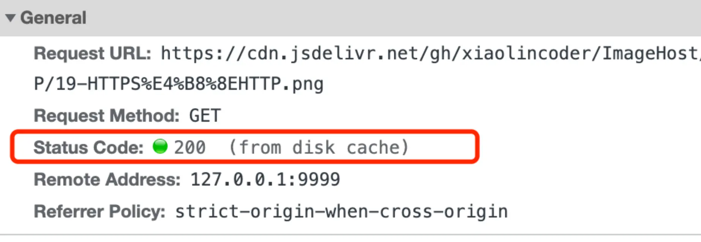
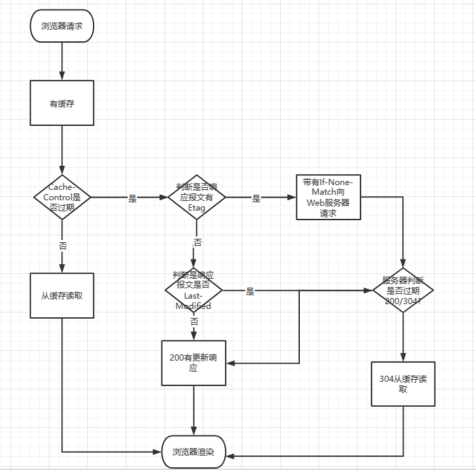

# HTTP缓存技术

## HTTP缓存有哪些实现方式？

HTTP缓存有两种实现方式：分别是强制缓存和协商缓存

## 什么是强制缓存

强缓存指只要浏览器判断缓存没有过期，则直接使用浏览器的本地缓存，决定是否使用缓存的主动性在于浏览器这边。

如下图中，返回的是 200 状态码，但在 size 项中标识的是 from disk cache，就是使用了强制缓存。

强缓存有效期主要通过两个字段实现，它们都表示资源在客户端缓存的有效期
- Cahce-Control，是一个相对时间
- Expires，是一个绝对时间

如果HTTP响应头部同时有Cache-Control和Expires字段，**Cache-Control的优先级高于Expires**

Cache-Control来实现强缓存
- 当浏览器第一次请求访问服务器资源时，服务器会在返回这个资源同时，在Response头加上Cache-Control，
    Cache-Control设置了过期时间大小

- 浏览器再次请求访问服务器该资源时，会先**通过请求资源的时间与Cache-Control中设置的过期时间大小，来计算
出该资源是否过期**，如果没有，则使用该缓存，否则重新请求服务器

- 服务器再次收到请求后，会再次更新Response头部的Cache-Control
  

  ## 什么是协商缓存
某些请求的响应码是304，这个告诉浏览器可以使用本地缓存，通常这种**通过服务端告知是否可以使用缓存的方式**称为协商缓存

两种方式实现协商缓存

1. 请求头部中的If-Modified-Since 字段与响应头部中的Last-Modified字段实现，什么意思呢？
   1. 响应头部中Last-Modified:标识这个响应资源的最后修改时间
   2. 请求头部中If-Modified-Since:当资源过期，发现响应头具有Last-Modified声明，则再次发请求
        带上Last-Modified的时间，如果最后修改时间比较新(da),说明资源又被改过，则返回最新资源，HTTP 200 ok
        如果最后修改时间较小(旧)，说明资源无新修改，响应HTTP 304走缓存

2. 请求头部中的If-None-Match与相应头部的ETag字段，这两个字段意思是：
   1. 响应头中Etag:唯一标识响应资源:
   2. 请求头部中If-None-Match:当资源过期时，浏览器发现响应头里有Etag，再次向服务器发起请求，会将请求头If-None-Match
        设置为Etag的值。服务器收到请求后进行比对，如果没有变化返回304，如果资源变化了返回200。

Etag的优先级>Last-Modified

## 协商缓存需要配合强缓存Cahce-Control

**协商缓存这两个字段需要配合强制缓存中Cache-Control字段来时候，
只有在未能命中强制缓存，才能发起带有协商缓存字段请求**

当使用 ETag 字段实现的协商缓存的过程：

- 当浏览器第一次请求访问服务器资源时，服务器会在返回这个资源的同时，在 Response 头部加上 ETag 唯一标识，这个唯一标识的值是根据当前请求的资源生成的；
- 当浏览器再次请求访问服务器中的该资源时，首先会先检查强制缓存是否过期：
  - 如果没有过期，则直接使用本地缓存；
  - 如果缓存过期了，会在 Request 头部加上 If-None-Match 字段，该字段的值就是 ETag 唯一标识；
- 服务器再次收到请求后，会根据请求中的 If-None-Match 值与当前请求的资源生成的唯一标识进行比较：
  - 如果值相等，则返回 304 Not Modified，不会返回资源；
  - 如果不相等，则返回 200 状态码和返回资源，并在 Response 头部加上新的 ETag 唯一标识；
- 如果浏览器收到 304 的请求响应状态码，则会从本地缓存中加载资源，否则更新资源

